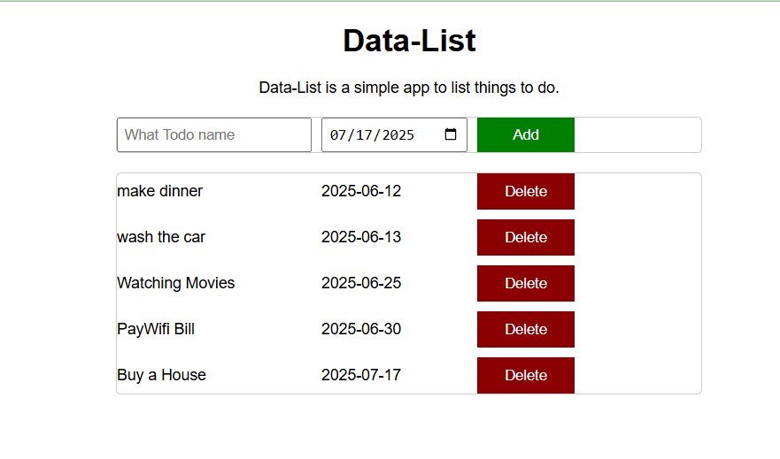

# 📝 To-Do List App

A dynamic, interactive web app to manage your daily tasks with due dates.

---

## 🚀 Features

- Add, view, and delete to-do items
- Set due dates for each task
- Data stored in a JavaScript array
- Dynamic HTML rendering using JavaScript
- Responsive and interactive UI

---

## 🛠️ Built With

- **HTML** – Structure
- **CSS** – Styling
- **JavaScript** – Logic (Array methods, loops, DOM manipulation)

---

## 📦 How It Works

1. **Add Tasks:** Enter a task and due date, then click "Add".
2. **View Tasks:** All tasks are displayed dynamically.
3. **Delete Tasks:** Remove tasks instantly with the "Delete" button.
4. **Live Updates:** The list updates in real-time as you interact.

---

## 📸 Screenshots



---

## ⚡ Quick Start

```bash
git clone https://github.com/SonOfChrist/ToDo_List.git
cd ToDo_List
# Open index.html in your browser or use Live Server in VS Code
```

---

## 📚 Concepts Demonstrated

- Saving and managing data in arrays
- Generating HTML dynamically
- Making web pages interactive with JavaScript
- Using loops to process data

---

## 💡 Customization

- You can extend the app to support editing tasks, marking as complete, or saving data to local storage.

---

Enjoy organizing your tasks!