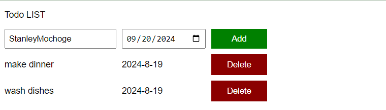

# ToDo_List
- It will Have a List of to Do and the Due Date
## [ all  Javascript programme ]
1. Save the Data
2. Generate the HTML [through Html Elements]
3. Make it interactive
- Html Css Javascript {Array & Loops [Looping Through the arrays]}

- Generate the Delete using javascript
- 

## Snapshot Of The List
 
